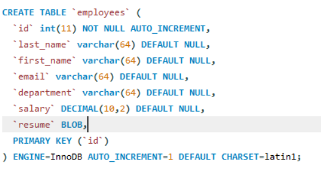
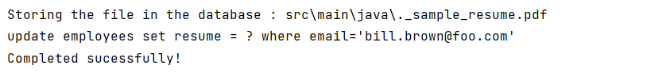

# Reading and Writing BLOBs

#### What are BLOBs?
1. A BLOB(binary large object) is the collection of binary data stored as a single entity in a database.
2. Blobs are typically documents, images, audio, or other binary objects.
3. Note: Database support for BLOB is not universal.

##### When creating a BLOB in a table
+ Add column with the **BLOB** data type 



#### Whiting a BLOB
* Add resume for a blob
  * read local pdf file: sample_resume.pdf
  * update database with the binary data 
 
 ````java
import java.io.File;
import java.io.FileInputStream;
import java.io.FileNotFoundException;
import java.sql.*;

public class WritingBlobs {
    public static void main(String[] args) throws SQLException {
        FileInputStream fileInputStream = null;
        Connection connection = null;
        File file = null;
        PreparedStatement statement = null;

        try {
            //Get a connection to the database
            connection = DriverManager.getConnection("jdbc:mysql://localhost:3306/demo", "student", "student");

            //prepare statement
            String sql = "update employees set resume = ? where email='bill.brown@foo.com'";
            statement = connection.prepareStatement(sql);


            //set parameter for resume file name
            file = new File("src/main/java/._sample_resume.pdf");
            fileInputStream = new FileInputStream(file);
            statement.setBinaryStream(1,fileInputStream);

            //executing the statement
            System.out.println("Storing the file in the database : " + file);
            System.out.println(sql);

            statement.executeUpdate();

            System.out.println("Completed sucessfully!");


        } catch (FileNotFoundException e) {
            throw new RuntimeException(e);
        }

    }
}

````


