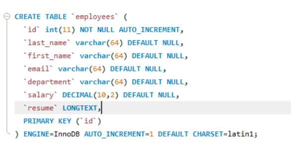

# Read the CLOBs

#### What is a CLOB?
+ A CLOB (Character Large Object) is the collection of characters data stored as a single entity in a database.
+ CLOBs are typically used to store large text documents (plain text or UML)
+ Note: Database support for CLOBs is not universal.

##### Create a CLOB column
+ Add a column with along text datatype.
+ Hold a maximum length of 4GB of characters.

#### Writing the CLOBS

+ Add resume for an employee 
  + Read local text file
  + Update Database with the text data 

