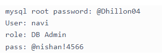
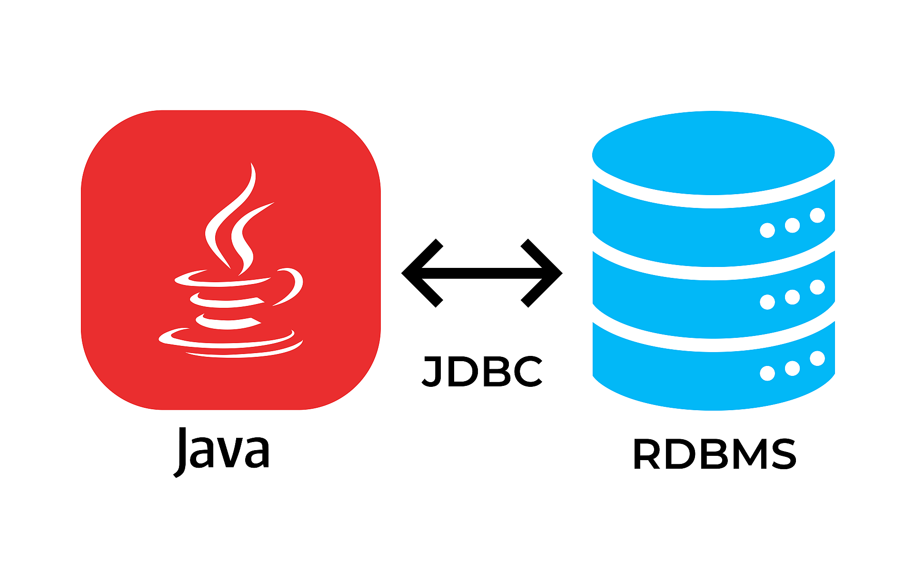

# JDBC Fundamentals 

# My JDBC database credentals 



# JDBC 
  + Allows Java applications to connect to relational database 
  
   # features
+ provide portable accesss to various databses 
       + no need to develop code for different databases its an **standard api**
+ Call level interface to the database 
  + support ansi sql 2003

+ you can build you own custom sql statements 
  + select, insert, update, delete 
  + Complex SQL queries: inner/outer joins
  + call stored processes


# databases support 
  ORACLE; DB2; MySQL; SQL SERVER; PostgreSQL
  
# JDBC Architechture 
+ JDBC Driver 
  + provide connection to database 
  + convert JDBC calls to for specific databases 
+ JDBC Driver impimentations 
  + provided by databse vendor 

# JDBC Driver manager 
+ Driver Manager helps to connect an application beased on the database connection string 
+ In JDBC 4.0, the JDBC Drivers are autometically loaded based on the classpath 
+ Legency JDBC 3.0 drivers have to be explicitly loaded with class.forName(the DriverName). and we no longer need that from JDBC 4.0.

# JDBC API 
+ JDBC API is defined in the following packages
  + java.sql and javax.sql 
+ Key classes
  + java.sql.DriverManger
  + java.sql.Connection
  + java.sql.Statement
  + java.sql.ResultSet
  + java.sql.DataSource (*for connection pooling*)


# Development Process
1. Get Connection to the database 
2. Create a statement object 
3. Execute SQL query 
4. Process Result Set

## Step 1: Get a Connection to the database 
+ In order to connect to the database 
  + Need connection string in form of JDBC URL 
+ Basic Syntax
    + ```jdbc:<driver protocol>:<driver connection details> ```

+ Examples 

  | Database      | JDBC URL                              |
  | ------------- | ------------------------------------- |
  | MS SQL Server | jdbc:odbc:DemonDSN                    |
  | Oracle        | jdbc:oracle:thin@myserver:1521:demodb |
  | MySQL         | jdbc:mysql://localhost:3306/demondb   |


+ Code snippet for connecting to mysql
  ``` java 
  import java.sql.*;
  ...
  String dbUrl  = "jsbc:mysql.//localhost/3306/demo
  String user = "student";
  String pass = "student";
  Connection myConn = DriveManager.getConnection(dbUrl, user, pass);
  ``` 
  
+ Failure to connect will through an execption:
  + java.sql.SQLException: *Bad url credentials *
  + java.lang.classNotFoundException: *JDBC driver is not in classpath *

## Step 2: Create a Statement Object 
+ Statement object is based on the connection

  - it will be used later to execute SQL query 
  
      ```java
      statement myStat = myConn.createSatatement(); 
     ```
    
## Step 3: Execute an SQL Query

+ pass in your SQL query 

     ``` java
     Resultset myRs = myStat.executeQuery("SELECT * FROM JOBS"); 
     ``` 
     
## Step 4: Process the result set 

+ Result set is initially placed before first row 
+ Method: **ResultSet.next() **
  + moves forward first row
  + returns true if there are more rows to process 
+ Looping through a resut set

```java
      Resultset myRs = myStat.executeQuery("SELECT * FROM JOBS");

      while (myRs.next()){
      // read data from each row
      }
```
      
+ Collection of methods for reading the 
  + get XXX(columName)
  + get XXX(columnIndex) one based
  
  
```java
      Resultset myRs = myStat.executeQuery("SELECT * FROM JOBS");

      while (myRs.next()){
      System.out.println(myRs.getString("lastName"));
      System.out.println(myRs.getString("firstName"));
      
      }
```
      


### Next from the tutorial 
+ Creating the table and adding the sample data 
+ Configure JDBC Driver in java IDE
+ Connect to DB: select, insert, update, delete 
+ Stored prcedures, transections and much more in the other slides..


    
    
  
