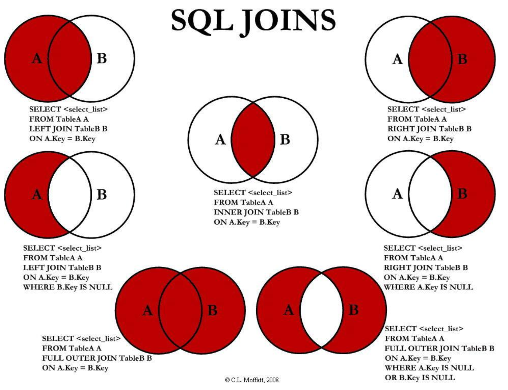

# SQL Joins 

# Joins 
The SQL Joins clause is used to combine records from two or more tables in a database. A JOIN is a means for combining fields from two tables by using values common to each.

Consider the following two tables −

**Table 1** − CUSTOMERS Table

```
+----+----------+-----+-----------+----------+
| ID | NAME     | AGE | ADDRESS   | SALARY   |
+----+----------+-----+-----------+----------+
|  1 | Ramesh   |  32 | Ahmedabad |  2000.00 |
|  2 | Khilan   |  25 | Delhi     |  1500.00 |
|  3 | kaushik  |  23 | Kota      |  2000.00 |
|  4 | Chaitali |  25 | Mumbai    |  6500.00 |
|  5 | Hardik   |  27 | Bhopal    |  8500.00 |
|  6 | Komal    |  22 | MP        |  4500.00 |
|  7 | Muffy    |  24 | Indore    | 10000.00 |
+----+----------+-----+-----------+----------+

```
**Table 2** − ORDERS Table

```
+-----+---------------------+-------------+--------+
|OID  | DATE                | CUSTOMER_ID | AMOUNT |
+-----+---------------------+-------------+--------+
| 102 | 2009-10-08 00:00:00 |           3 |   3000 |
| 100 | 2009-10-08 00:00:00 |           3 |   1500 |
| 101 | 2009-11-20 00:00:00 |           2 |   1560 |
| 103 | 2008-05-20 00:00:00 |           4 |   2060 |
+-----+---------------------+-------------+--------+

```
Now, let us join these two tables in our SELECT statement as shown below.
```
SQL> SELECT ID, NAME, AGE, AMOUNT
   FROM CUSTOMERS, ORDERS
   WHERE  CUSTOMERS.ID = ORDERS.CUSTOMER_ID;

```

This would produce the following result.
```
+----+----------+-----+--------+
| ID | NAME | AGE | AMOUNT |
+----+----------+-----+--------+
| 3 | kaushik | 23 | 3000 |
| 3 | kaushik | 23 | 1500 |
| 2 | Khilan | 25 | 1560 |
| 4 | Chaitali | 25 | 2060 |
+----+----------+-----+--------+

```

Here, it is noticeable that the join is performed in the WHERE clause. Several operators can be used to join tables, such as **=, <, >, <>, <=, >=, !=, BETWEEN, LIKE, and NOT**; they can all be used to join tables. However, the most common operator is the equal to symbol.

### There are different types of joins available in SQL −

**INNER JOIN** − returns rows when there is a match in both tables.

**LEFT JOIN** − returns all rows from the left table, even if there are no matches in the right table.

**RIGHT JOIN** − returns all rows from the right table, even if there are no matches in the left table.

**FULL JOIN** − returns rows when there is a match in one of the tables.

**SELF JOIN** − is used to join a table to itself as if the table were two tables, temporarily renaming at least one table in the SQL statement.

**CARTESIAN JOIN** − returns the Cartesian product of the sets of records from the two or more joined tables.

