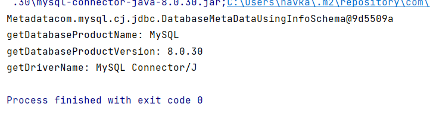

# Accessing Database Metadata 

+ Get Metadata Instance

````mysql
DatabaseMetadata databaseMetadata = myConn.getMetadata();
````
+ Database Metadata methods
  + getDatabaseProductName()
  + getDatabaseProductVersion()
  + getDriverName()
  + ...

+ Refer to javadoc for details
  + Goolgle JDBC Metadata

````java
import java.sql.Connection;
import java.sql.DatabaseMetaData;
import java.sql.DriverManager;
import java.sql.SQLException;

public class DatabaseMetadata {
    public static void main(String[] args) throws SQLException {
        Connection connection = DriverManager.getConnection("jdbc:mysql://localhost:3306/demo", "student", "student");
        DatabaseMetaData databaseMetadata = connection.getMetaData();

        System.out.println("Metadata" + connection.getMetaData());
        System.out.println("getDatabaseProductName: " + databaseMetadata.getDatabaseProductName());
        System.out.println("getDatabaseProductVersion: " + databaseMetadata.getDatabaseProductVersion());
        System.out.println("getDriverName: " + databaseMetadata.getDriverName());


    }
}

````

